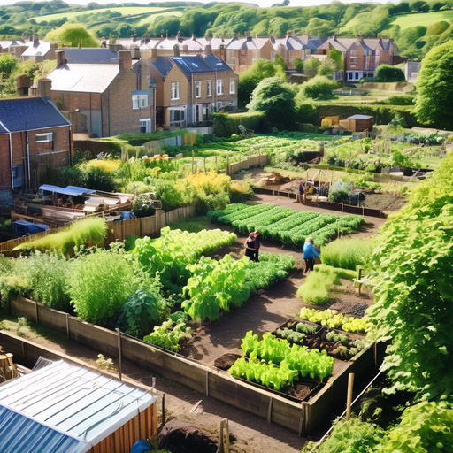

At Bipolar Risk, we're excited to introduce an innovative concept — a "phygital" collaborative space that combines the best of physical and online environments. Inspired by community allotments and gardens, we're creating a dynamic platform for resource exchange and community engagement: [**The Virtual Allotment**](https://darcy-ununited-pattie.ngrok-free.dev).

The Virtual Allotment builds on the principles of [The Personalised Recovery and Resilience Kit (PeRRK)](#0). Within this space, you can also explore the visual and written depiction of the [pagoda, used here as a metaphor for mental wellness](#0), as well the [PeRRK for Parenting](#0), and the [PeRRK for University Students](#0).

**What You Can Expect:**

- **Inspired by Community Allotments:** Like community allotments and gardens found throughout the UK, our space intends to maximize the potential of small parcels of land to produce valuable outcomes.

- **Active Engagement:** We believe in active engagement, where participants contribute, share, and exchange resources to create meaningful outcomes.

- **Positive Impact on Wellbeing:** Just like community allotments, our space promotes wellbeing by fostering a sense of community, connection, and purpose.

- **Promoting Responsible Behaviors:** We encourage responsible behaviors among participants, promoting values of knowledge exchange, diversity, and sustainability.

- **Guided by Clear Rules:** Our space operates within clear guidelines, ensuring safety, respect, and inclusivity for all participants.

- **Transparent and Replicable:** Just like community allotments, our model is transparent and easy to replicate, allowing for the creation of similar spaces in different contexts.

Join us in this exciting journey of collaboration, innovation, and community building.

